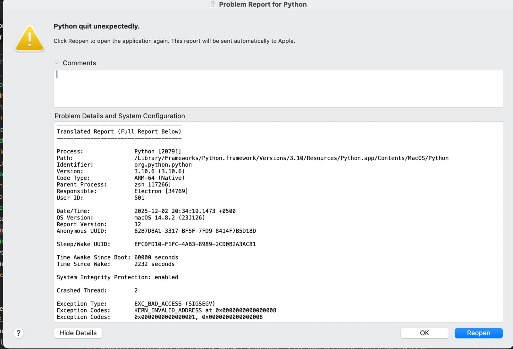

# IR-Repo: Hybrid Information Retrieval System

## Overview

**Hybrid Information Retrieval (IR)** system: This project explores the benefits of hybrid search, combining traditional, high-precision keyword matching with modern, high-recall semantic search to deliver highly relevant and well-ranked results.

The system utilize cutting-edge technologies like BM25, TF-IDF, **Learning-to-Rank (LTR)** models, BERT embeddings, and FAISS indexing to ensure fast and accurate search results.

## Key Features

- **Hybrid Ranking**: Combines both sparse (BM25, TF-IDF) and dense (BERT/FAISS) retrieval signals, with final results optimized using a **Learning-to-Rank (LTR)** model.

- **Embedding Generation & Indexing**: The `src/embeddings.py` script generates BERT embeddings for your documents, which are then indexed using the FAISS library to allow efficient similarity-based search.

- **Comprehensive Evaluation**: Automatically evaluates the systems performance through metrics such as
  **Precision**, **Recall**, `src/evaluation.py`.

- **Modular Design**: The project is divided into easy-to-manage components for preprocessing, indexing, querying, ranking, and evaluation.

## Prerequisites

- Python 3.10+ (or higher)
- All required dependencies are listed in `requirements.txt`, which includes libraries like PyTorch, Hugging Face Transformers, FAISS, and others.

## Setup & Installation

To get started with the project, we recommend setting up a virtual environment.
Below are steps how git working properly

### 1. Clone the Repository:

First, clone the repo to your local machine:

```bash
git clone https://github.com/CodeFramework-Tech/IR-repo.git
cd IR-repo
```

### 2. Create a Virtual Environment:

Set up a Python virtual environment to manage dependencies:

```bash
python3 -m venv .venv
source .venv/bin/activate
```

locally i make the system in macOS

### 3. Install Dependencies:

Install all the necessary libraries using the `requirements.txt` file:

```bash
pip install -r requirements.txt
```

## Usage

How the use of ssystem

### 1. Build & Index Documents

First Search
build the index first by this step will create all the required files for the system.

```bash
python -m src.hybrid_search build
```

### 2. Run a Search Query

Run a search query. The system will load the pre-built index, perform hybrid scoring (combining BM25, TF-IDF, and BERT), and return the ranked results.

```bash
python -m src.hybrid_search "What is the role of BERT in hybrid information retrieval systems?"
```

### 3. Evaluate Performance

To evaluate how well your system is performing, you have two options:

- **Single-Query Test**: Quickly test with a single query to calculate Precision and Recall.

  ```bash
  python evaluate_precision_recall.py
  ```

- **Batch Evaluation**: Run a more comprehensive evaluation that generates aggregated metrics such as **Mean Average Precision (MAP)** across multiple test queries.

  ```bash
  python -m src.evaluation
  ```

## Known Issues & Troubleshooting

Common issue which i also face while building the system

Like that error occur

- **Segmentation Fault (macOS)** On certain macOS hardware, you may encounter memory errors when initializing PyTorch/BERT/FAISS. The system has a built-in fallback to bypass the semantic search and run only the keyword-based ranking (BM25/LTR) if a crash is detected.
- **Missing Index Files**: If you see a `FileNotFoundError`, simply run the index-building command (`python -m src.hybrid_search build`) again to regenerate the index files.
